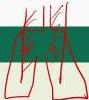

PNEUMONIA

- Infeksi **parenkim paru** selain oleh *Mycobacterium tuberculosis*
- Peradangan paru yang disebabkan oleh **non mikroorganisme** (bahan kimia, radiasi, aspirasi, obat-obatan lain) **disebut pneumonitis**

# JENIS

## A. Bronkopneumonia
Ditandai dengan **bercak-bercak infiltrate** pada lapangan paru. Dapat disebabkan oleh bakteria maupun virus. Sering pada bayi dan orang tua

## B. Pneumonia lobaris
Sering pada pneumonia bakterial, jarang pada bayi dan orang tua. Mengenai pada **satu lobus paru**

## C. Pneumonia Interstitial
Mengenai **ruang interstitial**

# KLINIS

## BSD
Batuk Sesak Demam

# PEMERIKSAAN FISIK

- **Inspeksi**: bagian tertinggal waktu bernafas
- **Palpasi**: fremitus dapat meningkat
- **Perkusi**: redup
- **Auskultasi**: suara nafas bronkovesikuler sampai bronkial, **ronkhi basah halus**, yang kemudian menjadi RBK pada stadium resolusi

Kelon Complete Batch Nov 2025

MEDIKO.ID

(KEMENKES PNEUMONIA, 2023) Hal 10