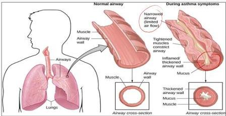

ASMA BRONKIAL

Asma adalah suatu kelainan berupa inflamasi (peradangan) kronik saluran napas yang menyebabkan hiper-reaktivitas bronchus terhadap berbagai rangsangan, umumnya bersifat reversible baik dengan atau tanpa pengobatan

## ASMA

1. Ada faktor pencetus
2. Riwayat atopi = allergi
3. Bersifat kronik residif

## GEJALA KLINIS

- Kondisi stabil/steady state → keluhan batuk malam hari dan sesak nafas saat olahraga alutnik
- Saat serangan (eksaserbasi akut) → sesak berat ditandai dengan wheezing
- Sesak nafas, batuk, rasa berat di dada dan berdahak
- Diawali oleh faktor risiko yang bersifat individu
- Respon terhadap pemberian bronkodilator ✓

Kelon Complete Batch Nov 2025

MEDIKO.ID

(PDPI, 2021) Hal. 3, 30

4