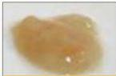
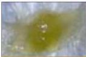
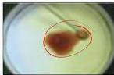

#

# ETIOLOGI

- Pneumonia komunitas : Gram (+), Streptococcus pneumonia
- Pneumonia nosokomial : Gram (-), Klebsiella pneumonia, Pseudomonas aeruginosa
- Pneumonia atipik : Chlamidya, Legionella, Mycoplasma CLM → wallya pneumonia
- Pneumonia aspirasi : bakteri anaerob (sputum berbau busuk)

# DIAGNOSIS CAP

&gt; X ray!

Infiltrat baru atau progresif + ≥ 2 gejala :

1. Batuk progresif
2. Perubahan karakter dahak/purulent;
3. Suhu aksila ≥ 38°C atau riwayat demam
4. Fisik : tanda konsolidasi, nafas bronkhial, ronkhi
5. Lab : leukositosis ≥ 10.000/leukopenia ≤4.500

Rush colored sputum S. Pneumonia betularal

Green putum Pseudomonas, Haemophyllus

Red current jelly sputum Klebsiella pneumonia

Kelon Complete Batch Nov 2025

MEDIKO.ID

(KEMENKES PNEUMONIA, 2023) Hal. 10