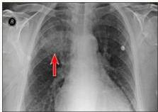
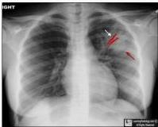
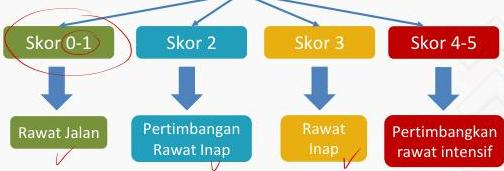

4

# GAMBARAN RADIOLOGIS

- Foto toraks (PA/lateral) merupakan pemeriksaan penunjang utama untuk menegakkan diagnosis.
- Gambaran radiologis dapat berupa **infiltrat sampai konsolidasi dengan "air bronchogram"**, penyebab bronkogenik dan interstisial serta gambaran kavitas.

Konsolidasi dan Air Bronchogram

# DERAJAT KEPARAHAN CAP

## CURB-65

- Confusion
- Ureum &gt; 40 mg/dL
- Frekuensi napas ≥ 30 x/m
- Tekanan darah : sistolik &lt; 90 mmHg dan diastolik ≤ 60 mmHg
- Umur ≥ 65 tahun

Kelon Complete Batch Nov 2025

MEDIKO.ID

(KEMENKES PNEUMONIA, 2023) Hal. 21