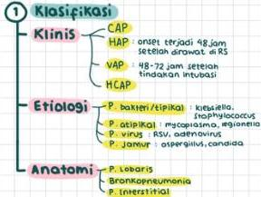
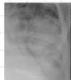
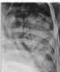
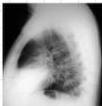
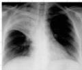

#

# Pneumonia

## 1 Klasifikasi

Klinis

CAP

HAP : onset terjadi 48 jam setelah dirawat di RS

VAP : 48-72 jam setelah tindakan intubasi

HCAP

Etiologi

P. bakteri/tipikal : klebsiella, Staphylococcus

P. atipikal : mycoplasma, Legionella

P. virus : RSV, adenovirus

P. jamur : aspergillus, candida

Anatomi

P. Lebaris

Bronkopneumonia

P. Interstitial

## 2 Diagnosis

- Berdapat infiltrat pada x-ray 4-5-2 gejala
- X-ray : air bronchogram
- batuk progresif
- suhu aksila &gt; 38 °C
- ronhhi
- leukosit &gt; 10.000 atau &lt; 4.500

## 3 Tata Loksana

|  CURB - 65 | Clinical Feature | Points  |
| --- | --- | --- |
|  C | Confusion | 1  |
|  U | Urea > 7 mmol/L | 1  |
|  K | RR > 30 | 1  |
|  B | SBP ≤ 90 mmHg OR | 1  |
|  G5 | DBP ≤ 60 mmHg |   |
|   | Age ≥ 65 | 1  |

## Points

D-1 : Rawat jalan

Azitromisin 500 mg/hari

atau Doxyliklin 2 x 100 mg tab

2 : Rawat inap

Levofloxacin 1x750 mg/hari

3 : ICU

β-lactam + Azitromisin / Fluoroquinolone

Kelon Complete Batch Nov 2025

MEDIKO.ID

4