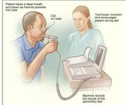
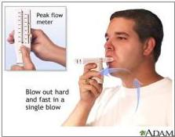

#

# PEMERIKSAAN FISIK

- Ditemukan : sesak nafas, **mengi (wheezing) dan hiperinflasi**
- Kasus sangat berat : *silent chest*, sianosis, gelisah, sukar bicara, takikardi, hiperinflasi dan penggunaan otot bantu nafas

# KLASIFIKASI

1. Derajat saat stabil &amp; sebelum pengobatan ☑
2. Derajat saat serangan ☑
3. Derajat kendali ☑

# PEMERIKSAAN PENUNJANG

Spirometri: FEV1, KVP, dan APE
- FEV1 ≥ 12% atau 200 cc paska bronkodilator -&gt; menunjukkan reversabilitas
- FEV1/FVC &lt; 75% atau FEV1 &lt; 80% nilai prediksi
- Tujuan : menilai derajat asma

# Peak Flow Meter: APE

- Peningkatan 60 L/menit atau ≥ 20% paska bronkodilator
- Variasi diurnal &gt;20%
- Tujuan : pemantauan terapi

Kelon Complete Batch Nov 2025

MEDIKO.ID

(PDPL 2021) Hal. 30-35