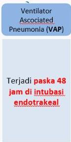

RATIONALE

Pasien menjalani ventilasi mekanik. Pada hari ke-4 pemasangan ventilator, muncul demam tinggi, sputum purulen, dan infiltrat baru pada foto toraks. → Dx. Ventilator Associated Pneumonia

A. CAP (terjadi dalam 48 jam pertama perawatan)
B. HAP (terjadi setelah 48 jam perawatan di RS)
C. VAP
D. Bronkiolitis (kurang tepat)
E. ARDS (kurang tepat)

Kelon Complete Batch Nov 2025

MEDIKO.ID

Referensi: Soal UKMPPD 2020