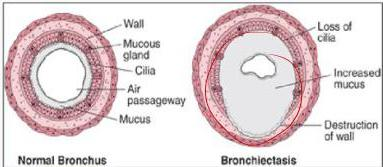
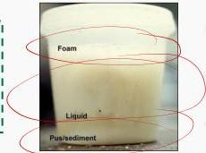

BRONKIEKTASIS

Merupakan kelainan kronik yang ditandai dengan dilatasi bronkus secara permanen, disertai proses inflamasi pada dinding bronkus dan parenkim paru sekitarnya

PATOFISIOLOGI

- Dilatasi patologis bronkus
- Obliterasi percabangan berikutnya
- Retensi sekret mubociliary (X)
- Peradangan kronik pada jaringan setempat

KLASIFIKASI

- Kongenital (immotile cilia syndrome, defisiensi enzim alfa-antitrypsin)
- Akuisita (infeksi saluran nafas bawah berulang)

Sputum 3 lapis pada bronkiektasis :
- Busa
- Saliva/cairan jenih
- Pus/endapan

Kelon Complete Batch Nov 2025

MEDIKO.ID

(PDPI, 2021) Hal. 39

3A