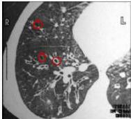
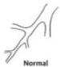
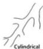
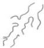
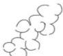

3A

# PEMERIKSAAN FISIK

- Tergantung pada luas, derajat dan ada tidaknya obstruksi saluran nafas
- Auskultasi: ronki basah biasanya pada basal paru
- Sering dijumpai jari tabuh

# PEMERIKSAAN PENUNJANG

1. CXR → honeycomb appearance dengan atau tanpa air fluid level
- Gold standard → High Resolution CT (HRCT) = SIGNET RING CELL
- Bronkografi

Normal

Cylindrical

Varicose

Cystic

- Bronkiektasis silindris atau tubular → dilatasi saluran napas
- Bronkiektasis varikosa → area konstriktif fokal disertai dengan dilatasi saluran napas
- Bronkiektasis kistik atau sakular → paling berat, kista ukuran besar, sakula/gambaran grape-like clusters

Kelon Complete Batch Nov 2025

MEDIKO.ID

(PDPI, 2021) Hal. 39