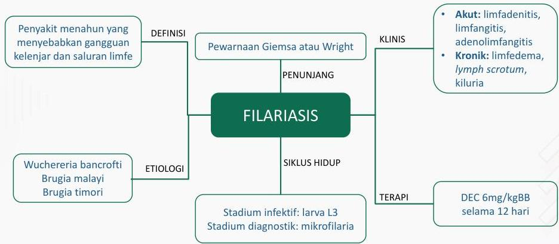

Kelon Complete Batch Nov 2025

MEDIKO.ID
MEDIKO INDOOR ASSOCIATION
(PAPDI, 2014) Hal. 769

4A

Penyakit menahun yang menyebabkan gangguan kelenjar dan saluran limfe

DEFINISI

Pewarnaan Giemsa atau Wright

KLINIS
- Akut: limfadenitis, limfangitis, adenolimfangitis
- Kronik: limfedema, lymph scrotum, kiluria

Wuchereria bancrofti
Brugia malayi
Brugia timori

ETIOLOGI

SIKLUS HIDUP

TERAPI

DEC 6mg/kgBB
selama 12 hari

