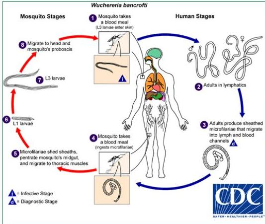

4A

# Wuchereria bancrofti

## Mosquito Stages
1. Mosquito takes a blood meal (L3 larvae enter skin)

## Human Stages
1. Migrate to head and mosquito's proboscis
2. L3 larvae
3. L1 larvae
4. Microfilariae shed sheaths, penetrate mosquito's midgut, and migrate to thoracic muscles
5. Infective Stage
6. Diagnostic Stage

## Human Stages
1. Adults in lymphatics
2. Adults produce sheathed microfilariae that migrate into lymph and blood channels

BAFER / HEALTHIER / PEOPLE

# SIKLUS HIDUP

- Cacing akan masuk ke sistem limfatik dan menyumbat.
- Stadium infektif: larva L3
- Stadium diagnostik: mikrofilaria

# MEDIKOLOGIC

BMT 123 (cephalic space)
W. bancrofti: 1:1
Brugia malayi: 2:1
Brugia timori: 3:1

Kelon Complete Batch Nov 2025

MEDIKO.ID

(PAPDI, 2014) Hal. 769