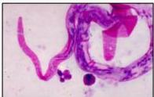

4A

# PENUNJANG

Identifikasi mikrofilaria dari sediaan darah tebal/tipis pada pukul 22.00-02.00 dengan pewarnaan Giemsa atau Wright

# TATALAKSANA

## Lini 1:

Dietilcarbamazine (DEC) 6 mg/kgBB (atau 3 x 100 mg) selama 12 hari untuk limfatik filariasis
Dapat kombinasi dengan ivermectin 150 µg/kg single dose (TIDAK boleh pada ibu hamil dan anak &lt;5 tahun)

## Lini 2:

- Doksisiklin 200 mg/hari selama 4-6 minggu atau
- Doksisiklin 200 mg/hari selama 23 hari diikuti doksi + albendazol 7 hari

# PROFILAKSIS

- DEC 6 mg/kgBB single dose dan albendazole 400 mg SD per tahun
- Atau Ivermectin 150-200 mcg/kg/SD dan albendazole 400 mg SD per tahun

Kelon Complete Batch Nov 2025

MEDIKO.ID

(PAPDI, 2014) Hal. 769