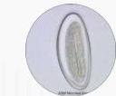
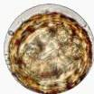
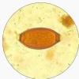
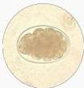

NEMATODA

# MEDIKOLOGIC

## ENTEROBIUS VERMICULARIS
"Pani D Graham"

- Pruritus ANI
- Bentuk telur seperti huruf D
- Graham scoth tape

## ASCARIS LUMBRICOIDES

- Telur bulat 3 lapis
- Ileus obstruktif
- Sindrom Loeffler (IgE-eosinophilic)

## TRICHURIS TRICHIURA 3T

- Tempayan
- Turun (prolapse recti)

## ANCYLOSTOMA DUODENALE DAN NECATOR AMERICANUS

- Dinding tipis, telur jernih/bening.
- Anemia
- Harada Mori Test

Kelon Complete Batch Nov 2025

MEDIKO.ID

4A