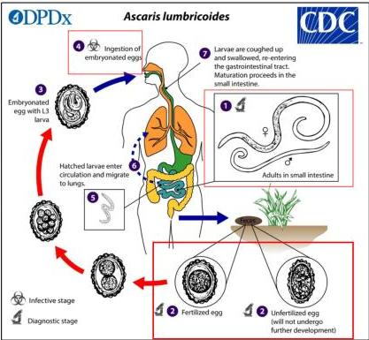

ASKARIASIS

# SIKLUS HIDUP

# ASKARIASIS

- Telur terdiri dari 3 lapis yaitu: albuminoid, hialin dan vitelina
- Keluar cacing dari anus
- **TATALAKSANA :**
- **Albendazole (lini pertama)**: 400 mg PO dosis tunggal.
- Mebendazole 500 mg PO SD, atau 2x100 mg selama 3 hari.
- Pirantel pamoat: 10 mg/kg dosis tunggal.

Kelon Complete Batch Nov 2025

MEDIKO.ID

(PERMENKES, 2017) Hal. 25

4A