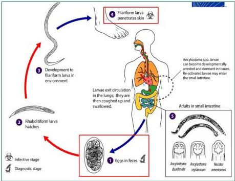
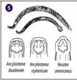

#

CACING TAMBANG

SIKLUS HIDUP

# CACING TAMBANG

Infeksi akibat:
- Ancylostoma duodenale → anthropofilik
- Necator americanus → anthropofilik
- Ancylostoma braziliense → zoofilik (kucing)
- Ancylostoma caninum → zoofilik (anjing)

# TATALAKSANA:

## GI
- Albendazole 400 mg PO SD
- Mebendazole: 2x100 mg 3 hari.
- Pirantel pamoat 10mg/kg dan sulfas ferosus.

## CLM
- Albendazole 400 mg PO 3-7 hari
- Topical (7 hari; 3x/hari)
- Albendazole
- Tiabendazole

MEDIKOLOGIC

Cacing tambang antropofilik menyebabkan infeksi GIT
Cacing tambang zoofilik menyebabkan cutaneous larva migrans

Kelon Complete Batch Nov 2025

MEDIKO.ID

(PERMENKES, 2017) Hal. 27