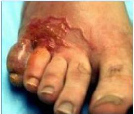

CUTANEOUS LARVA MIGRANS (CLM)

# CLM

## ETIOLOGI
- Ancylostoma braziliense, caninum

## UKK
- Muncul dalam 1-5 hari setelah pajanan berupa plak eritematosa, vesicular, linear, dan serpiginosa

## PREDILEKSI
- Predileksi pada kaki yang kontak dengan tanah dan bokong

## TATALAKSANA
- Topikal: salep albendazole / tiabendazol 3x sehari selama 7-10 hari
- Sistemik:
- Albendazole 400 mg selama 3-7 hari,
- Thiabendazole 50 mg/kg/hari selama 2-4 hari.

## MEDIKOLOGIC
- Main di air → SWIMMER ITCH: Schistosoma
- Tidak pakai alas kaki → GROUND ITCH: CACING TAMBANG

Kelon Complete Batch Nov 2025
MEDIKO.ID
(PAPDI, 2014) Hal. 779
4A