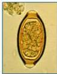
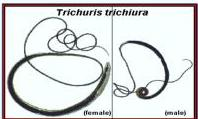
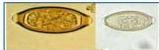
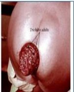

TRICHURIASIS

# TRIKURIASIS

- Berbentuk seperti tempayan, tong anggur (barrel shape) atau lemon shape, ukuran 50 x 23 mikron, pada kedua ujungnya terdapat dua buah mucoid plug (sumbat yang jernih)
- Cacing berbentuk seperti cambuk, 3/5 bagian depan kecil, bagian belakang lebar.

# TATALAKSANA

- Albendazole 1x400 mg selama 3 hari
- Mebendazole 2x100 mg selama 3 hari atau 500 mg dosis tunggal.

Kelon Complete Batch Nov 2025

MEDIKO.ID

(PAPDI, 2014) Hal. 779

4A