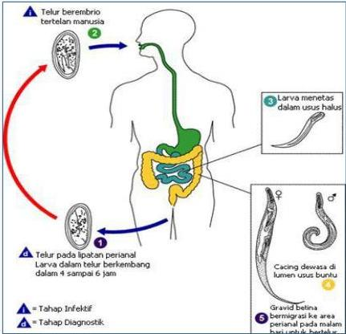
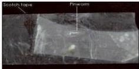
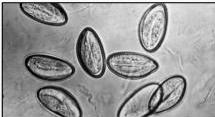

#

ENTEROBIASIS

## ENTEROBIASIS

- Gatal di sekitar dubur (pada malam hari pada saat cacing betina meletakkan telurnya)
- Kata kunci UKMPPD: keluar cacing dari anus
- Terjadi autoinfeksi
- PP: perianal swab dengan scotch tape

## TATALAKSANA

- Pirantel Pamoat 10 mg/kgBB
- Piperazin 1x2,25-3 gram 7 hari
- Mebendazole 100 mg PO
- Albendazole 400 mg SD, diulang dalam 2 minggu

Kelon Complete Batch Nov 2025

MEDIKO.ID

(PAPDI, 2014) Hal. 779

4A