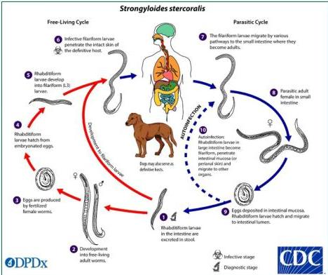

STRONGILOIDES STERCORALIS

# SIKLUS HIDUP

# STRONGILOIDIASIS

Infeksi ini pada umumnya didahului oleh infeksi HTLV-1, konsumsi obat steroid, immunosuppressive drugs, transplantasi organ

Strongyloides Stercoralis/Cacing Benang

Telur menetas → larva rhabditiform → larva filariform → menembus kulit → vena → jantung → paru → trakea → laring → batuk → usus halus → dewasa.

Stadium infektif: larva filariform
Stadium diagnostik: larva rabditiform

Kelon Complete Batch Nov 2025

MEDIKO.ID

(PAPD), 2014) Hal. 790

4A