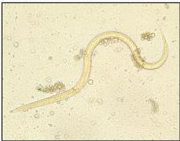
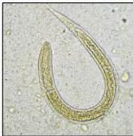

4A

# PENUNJANG

- Mikroskopis feses (diagnosis definitif): ditemukan larva rabditiform
- Kultur feses
- Darah lengkap: eusinofilia
- Peningkatan IgE
- ELISA → ditemukan antigen larva

# TATALAKSANA

## INFEKSI GIT

- Albendazole 1 x 400 mg selama 3 hari berurutan; atau
- Mebendazole 3 x 100 mg selama 2-4 minggu

## CREEPING ERUPTION

- Albendazole 1 x 400 mg selama 5 hari berurutan; atau
- Tiabendazole topikal selama 1 minggu

Kelon Complete Batch Nov 2025

MEDIKO.ID

(PAPDI, 2014) Hal. 790; (KONSENSUS, 2024) Hal. 43