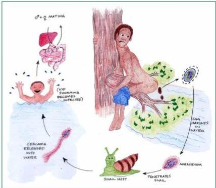
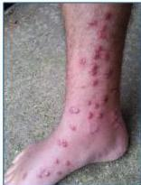

SCHISTOSOMIASIS/BILHARZIASIS

SIKLUS HIDUP

TREMATODA DARAH

Empat (4) "S"
- Schisostoma
- Spina Terminalis
- Serkaria
- Swimmer itch

Katayama Fever
"Acute Schistostomiasis"

Kelon Complete Batch Nov 2025

MEDIKO.ID

(PAPDI, 2014) Hal. 789

4A