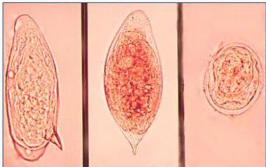
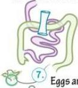
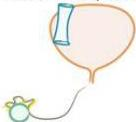

4A

# TELUR SCHISTOSOMA

- S. HaemaTobium : spina Terminal.
- S. Mansoni : spina Minggir (di pinggir)
- S. Japonicum : spina terminal kecil (rudimenter).

Eggs are excreted.

# TATALAKSANA

## Prazikuantel

S. haematobium, S.mansoni 40 mg/kg dibagi 2 dosis
S. Japonicum 60 mg/kg dibagi 3 dosis

Kelon Complete Batch Nov 2025

MEDIKO.ID

(PAPDI, 2014) Hal. 789