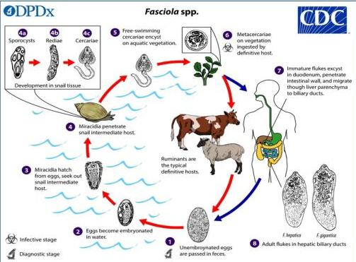
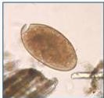

FASCIOLIASIS

# Siklus Hidup

# Telur Schistosoma spp.

- Disebabkan oleh Fasciola hepatica.
- Gejala dan tanda :
- Fase akut : Nyeri perut, mual, muntah, hepatomegali, malaise, demam, batuk, eosinofilia perifer, dan peningkatan kadar transaminase.
- Fase kronik : gejala cholangitis, cholecystitis

# Tatalaksana

DOC: Triclabendazole 10mg/kgBB

# Telur BESAR BEROPERCULUM

Kelon Complete Batch Nov 2025

MEDIKO.ID

[PAPDI, 2014] Hal. 789

4A