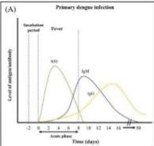
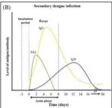
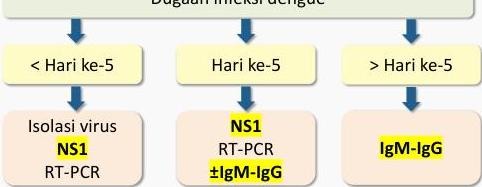

#

# PENUNJANG

# PNPK 2021

|  IgM | Ig G | Interpretasi  |
| --- | --- | --- |
|  (+) | (-) | Infeksi primer  |
|  (+) | (+) | Infeksi sekunder  |
|  (-) | (+) | Pernah terinfeksi  |
|  (-) | (-) | Tidak ada infeksi  |

# Prosedur Tes Torniquet

## Cara Rumple Leed Test

- (Sistol + diastol) / 2 → tahan 5 menit
- + jika ≥10 petekie dalam 2,5cm x 2,5cm

## Cara Hess

- (Sistol + diastol) / 2 → tahan 10 menit
- + jika &gt;15 dalam diameter 5cm

Kelon Complete Batch Nov 2025

MEDIKO.ID

(PNPK DENGUE, 2020) Hal. 27

4A