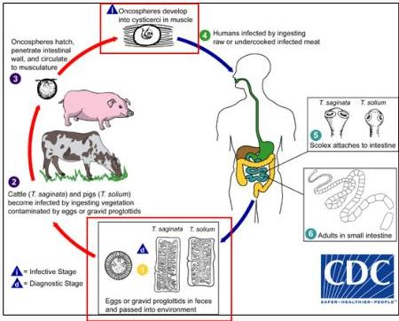
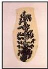
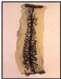

TAENIASIS

# SIKLUS HIDUP

# MEDIKOLOGIC

- Taenia "SAPINATA" → pada SAPI
- Berarti solium pada "babi"

Taenia solium 3-13

Taenia saginata 13-30

Kelon Complete Batch Nov 2025

MEDIKO.ID

[PAPDI, 2014] Hal. 783

4A