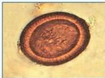
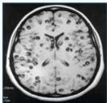

#

# TAENIASIS

- Neurosistiserkosis disebabkan oleh Taenia Solium
- Jika telur Taenia sp. Tertelan → muncul sistiserkosis di otot, mata hingga otak → diagnosis menjadi sistiserkosis, neurosistiserkosis terjadi pada taenia solium.
- Jika daging yang mengandung sistiserkus tertelan → cacing dewasa dalam usus → diagnosis menjadi taeniasis.

## Ciri-ciri telur

Telur bulat, dinding tebal, struktur radial, berisi embrio

# TATALAKSANA

- Taeniasis: prazikuantel 10 mg/kgBB SD
- PPK:
- Albendazole 400 mg, 3 hari
- Mebendazole 3 x100mg, selama 2-4 minggu
- Sistiserkosis: prazikuantel/albendazole/bedah.

Kelon Complete Batch Nov 2025

MEDIKO.ID

(PAPDI, 2014) Hal. 783

4A