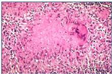

LIMFADENITIS

# DEFINISI

- Limfadenopati: pembengkakan KGB, peradangan (-)
- Limfadenitis: radang pada KGB
- Limfangitis: radang pada saluran getah bening

# KLASIFIKASI &amp; KLINIS

Klasifikasi:
- Spesifik: akibat M. tuberculosis
- Non-spesifik: infeksi lainnya

Manifestasi
Limfadenopati + demam, malaise, nyeri tekan

Granuloma TB

# PENUNJANG

- DL: Leukositosis
- FNAB
- Spesifik TB: granuloma (+), nekrosis kaseosa (+), sel datia langerhans (+)
- Pemeriksaan BTA dari limfe
- Chest X-ray: TB paru

# TATALAKSANA

- Spesifik: Mengikuti regimen pengobatan TB paru, lama terapi 6-9 bulan
- Nonspesifik: tatalaksana sesuai etiologi

Kelon Complete Batch Nov 2025

MEDIKO.ID

(KEMENKES, 2022) Hal. 203