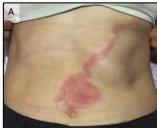
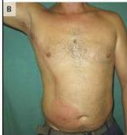
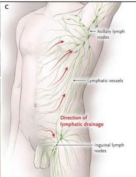

LIMFANGITIS

# DEFINISI

- Infeksi pembuluh limfe yang berasal dari fokus inflamasi
- Organisme patogen masuk saluran limfatik melalui abrasi/luka/komplikasi infeksi
- Biasanya didahului trauma

# KLINIS

- Pembengkakan asimetris
- Goresan merah **membentuk alur** dari daerah terinfeksi ke ketiak atau pangkal paha
- Demam, nyeri, sakit kepala

# TATALAKSANA

- Demam tinggi + tampak toksik → ranap + antibiotik IV
- Suportif: analgetik, antipiretik, antiinflamasi
- Kompres hangat, elevasi lengan/tungkai

Kelon Complete Batch Nov 2025

MEDIKO.ID

(PPK PRIMER, 2014) Hal. 34

4A