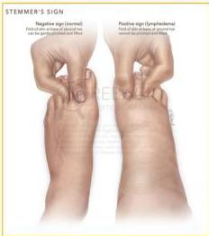

LIMFEDEMA

# DEFINISI

Obstruksi sistem limfatik → Drainase terhenti → Akumulasi cairan tinggi protein → pembengkakan (utama pada lengan dan kaki)

# KLASIFIKASI

- Limfedema primer/prekoks: abnormalitas/tidak adanya pembuluh limfe
- Limfedema sekunder/tarda: terhambatnya aliran limfe, akibat infeksi, radiasi, sikatrik, setelah pengobatan ca mammae.

# KLINIS

- Pembengkakan kronis
- Asimetris (1 tungkai lebih besar)
- Umumnya pada ekstremitas bawah
- Infeksi kulit bakteri/jamur
- Edema regional: awalnya pitting edema, lembut → fibrosis kronik
- Stemmer sign
- (+): lipatan kulit di pangkal digiti 2 atau 3 tidak bisa dicubit/diangkat → limfedema
- (-): lipatan kulit di pangkal jari 2 bisa dicubit/diangkat → normal

Kelon Complete Batch Nov 2025

MEDIKO.ID

(KEMENKES, 2022)

3A