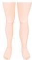
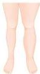
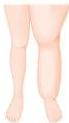
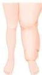

#

# KLASIFIKASI BRUNNER

|  Derajat (Brunner) | Manifestasi Klinis  |
| --- | --- |
|  Subklinis (laten) | Adanya cairan intestinal berlebih dan abnormalitas histologis pada limfatik dan kelenjar limfe, tetapi tidak telihat limfedema secara klinis  |
|  I | Edema menghilang pada penekanan dan pembengkakan sebagian besar atau sepenuhnya hilang dengan elevasi dan istirahat  |
|  II | Edema tidak menghilang dan tidak berkurang secara signifikan dengan elevasi, Stemmer’s sign (+)  |
|  III | Edema berkaitan dengan perubahan kulit irreversible (fibrosis, papillae)  |

Stage 0

Stage 1

Stage 2

Stage 3

Kelon Complete Batch Nov 2025

MEDIKO.ID

(KEMENKES, 2022)

3A