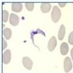
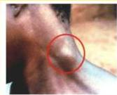
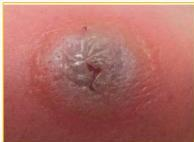

AFRICAN TRYPANOSOMES

# MANIFESTASI KLINIS

- Chancre trypanosomal: ulkus chancre di tempat gigitan lalat
- Hemolimfatik:
- demam intermitten
- pruritus
- Winterbottom sign: limfadenopati servikal posterior
- Meningoencephal:
- SSP (gangguan tidur) → gangguan putri tidur
- Jantung (perimyocarditis)

# PENUNJANG

- Pemeriksaan light-microscopic (aspirat KGB, darah, CSF)
- RDT dan serologi (T. b. gambiense)

# TATALAKSANA

## Stadium I

- T. b. rhodesiense → suramin dan melarsoprol
- T. b. gambiense → pentamidine atau fexinidazole

## Stadium II

- T. b. rhodesiense → suramin dan melarsoprol
- T. b. gambiense → kombinasi nifurtimox eflornithine

Kelon Complete Batch Nov 2025

MEDIKO.ID

(WHO, 2023)