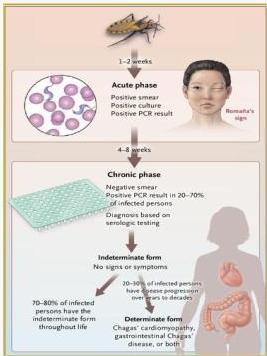

CHAGAS DISEASE

# FASE KLINIS

- Inkubasi (1-2 minggu)
- Fase akut (8-12 minggu):
- asimtomatik
- Chagoma: pembengkakan di area gigitan (wajah, ekstremitas)
- Romana sign: pembengkakan area kelopak mata, nyeri (-)
- Demam, malaise, anoreksia
- Fase indeterminate (bertahun-tahun): asimtomatik
- Fase kronis (10-20 tahun)
- RBBB, DCM, HF, aritmia
- Megaesophagus, akalasia, disfagia, konstipasi

# PENUNJANG

- Fase akut:
- ADT tebal &amp; tipis → pengecatan Giemsa → trypomastigote
- Uji aglutinasi, PCR
- Fase kronis
- ELISA: igG T. cruzi
- Echocardiography
- Barium swallow

# TATALAKSANA

- 1st line: Benznidazole
- 2nd line: Nifurtimox

# MEDIKOLOGIC

AMERIKA suka KISSING

Chagas disease asal AMERIKA

vektor KISSING bug

Kelon Complete Batch Nov 2025

MEDIKO.ID

(WHO,2024)