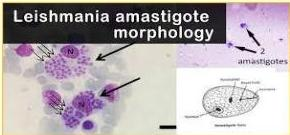

LEISHMANIASIS

# DEFINISI

- Nama lain:
- Leishmaniasis visceral
- **Kala-Azar**
- Etiologi: parasit *Leishmania donovani*
- Vektor: sandflies (lalat phlebotomus)
- Endemis di Asia Selatan dan Afrika (Eropa, Sudan)

# KLINIS

- Leishmaniasis visceral (kala-azar)
- Demam, BB menurun, hepatospelonmegali, pansitopenia
- Leishmaniasis Kutan
- Kongesti nasal persisten dan perdarahan yang diikuti dengan destruksi ulserastif progresif.
- Leishmaniasis Mukosa
- Papul, plaque nodular, lesi ulseratif dengan tepi meninggi dan indurasi

# PENUNJANG

- Gold Standard: **Kultur parasit** (agar Novy-McNeal-Nicolle) dari jaringan sumsum tulang (visceral)/limfa, lesi kulit (cutaneous)
- HistoPA → **amastigot** (badan ovoid berukuran 1-5 mikron, biasanya di dalam makrofag)

# TATALAKSANA

- Amphotericin B liposomal 3 mg/kg/hari IV hari 1-5, hari ke-14, dan hari ke-21
- Paromomycin 15 mg/kg/hari selama 21 hari

Kelon Complete Batch Nov 2025

MEDIKO.ID

(WHO, 2023)