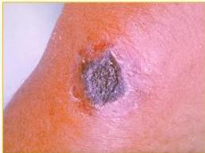

KELON COMPLETE BATCH NO: 2025

KELON COMPLETE BATCH NO: 2024

# ANTHRAX

## DEFINISI

- Etiologi: B. anthraxis
- Port d'entry: kulit, inhalasi → sistemik → multiplikasi cepat → toksin
- Faktor risiko: dokter hewan, peternak, travelers, military personnel (bioterrorist attack)

## JENIS

- Cutaneous anthrax (95% cases):
- makula/papula/vesikel/pustula, ulkus + jaringan nekrotik dan edema. nyeri (-)
- limfadenitis regional nyeri (+)
- Anthrax inhalasi = Wool Sorter’s syndrome
- demam, sesak, stridor, hipoksia, hipotensi
- X-ray: hemorrhagic mediastinitis (symmetrical mediastinal bleeding)
- Anthrax GI tract: demam mual muntah, nyeri abdomen, diare berdarah, ascites
- Oropharyngeal anthrax: nyeri tenggorok, disfagia, nekrosis/hemoragik/exudative tonsil

## PENCEGAHAN

- Dekontaminasi produk-produk hewan seperti bulu domba
- Vaksinasi; Imunisasi hewan peliharaan
- Mengubur-membakar binatang yang mati karena anthrax
- Hindari menyembelih binatang yang terdeteksi

## PENUNJANG &amp; TATALAKSANA

Penunjang
- Pengecatan: Gram (+), oval spora di tengah
- DL: leukosit normal/meningkat
- Tatalaksana: Ciprofloxacin, doksisiklin