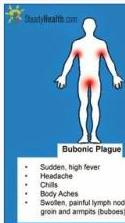
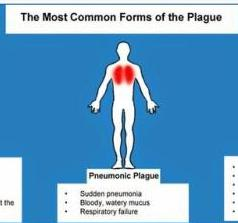
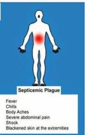

PLAGUE

# DEFINISI

- Penyakit zoonosis sistemik
- Etiologi: Yersinia pestis (bakteri Gram (-)) → menularkan ke tikus kecil di pedesaan Afrika, Asia, Amerika
- Vektor: arthropoda (flea)

# PENUNJANG &amp; TATALAKSANA

- Penunjang: pemeriksaan mikroskopik pewarnaan Gram, Wright, giemsa, atau Wayson dari darah, KGB, atau sputum
- Tatalaksana: Antibiotik: Ciprofloxacin, levofloxacin

# JENIS

- Bubonic plague
- Demam, malaise, myalgia, pusing, limfadenitis + nyeri pada area gigitan
- Pneumonic plague
- Inhalasi bakteri dalam droplet hewan terinfeksi
- demam, nyeri kepala, myalgia, kelemahan, nausea, muntah, pusing, batuk, sesak, nyeri dada, hemoptisis
- Septicemic plague: kulit kehitaman
- Meningitis, Faringitis

Kelan Complete Batch Nov 2025

MEDIKO.ID

MEDIKO NATIONAL ASSOCIATION

(WHO,2022)