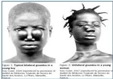

#

FRAMBUSIA/PATHEK/YAWS

# DEFINISI

Infeksi *Treponema pallidum* subsp. *pertenue* jangka panjang (kronis) yang paling sering mengenai kulit, tulang, dan sendi

# PENUNJANG &amp; TATALAKSANA

- Penunjang: TPHA-RDT dan dievaluasi dengan RPR/VDRL
- Tatalaksana: Azitromisin 1x2000mg SD

|  STADIUM I (Primer) | STADIUM II (Sekunder) | STADIUM III (Tersier)  |
| --- | --- | --- |
|  3-5 minggu setelah terpapar
Papul tunggal/multiple
Papiloma
Nodul
Ulkus
Krusto papilloma
limfadenopati | Lesi kulit sama seperti
stadium I tersebar ke muka,
lengan, tungkai, pantat
Telapak tangan kaki
hiperkeratotik, fisurasi, nyeri | 10% orang yang terinfeksi
Perlunakan -> rusak -> cacat
Gangosa
Juxta articular nodes bengkak
Gondou
Telapak tangan kaki
hiperkeratotik, fisurasi, nyeri  |
|  Early (dini) |   | Late (lanjut)  |
|  Sangat menular |   | Tidak/kurang menular  |

Kelon Complete Batch Nov 2025

MEDIKO.ID

(KEMENKES, 2017) Hal. 23