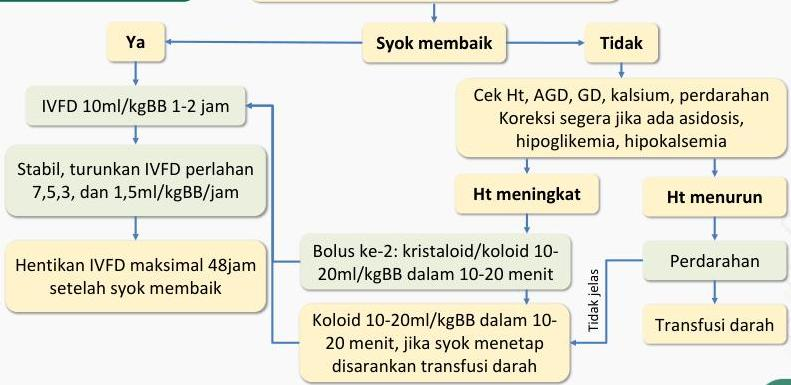

4A

# MANAJEMEN SYOK DENGUE TERKOMPENSASI (DBD GRADE III)

- O2 2-4 LPM
- Cek Hct
- Kristaloid RL/RA 10-20ml/kgBB dalam 60 menit

Kelon Complete Batch Nov 2025

MEDIKO.ID

(PNPK DENGUE, 2020) Hal. 55-56

4A