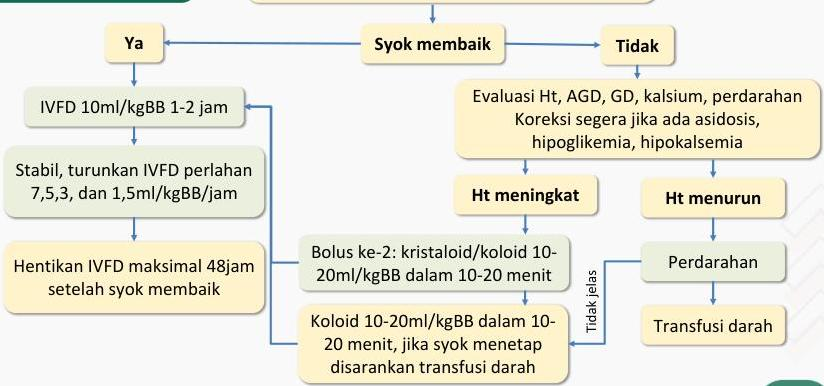

4A

# MANAJEMEN SYOK DENGUE DEKOMPENSASI (DBD GRADE IV)

- O2 2-4 LPM
- Cek Hct, AGD, GD, kalsium, perdarahan
- Kristaloid RL/RA 10-20ml/kgBB dalam 10-20 menit

Kelon Complete Batch Nov 2025

MEDIKO.ID

(PNPK DENGUE, 2020) Hal. 55-56