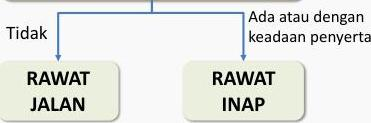

#

Pasien dengan gejala demam dengue
Apakah ada warning sign atau tanda-tanda syok atau perdarahan spontan?

Tataka
RAWAT
JALAN
RAWAT
INAP

# TATALAKSANA PASIEN RAWAT INAP(PNPK 2021)

Pemeriksaan awal, DL. Monitor balans cairan, motivasi asupan cairan oral monitor TTV 4 jam atau lebih sering
Apakah asupan cairan oral pasien cukup?

Cek Ht, berikan kristaloid IV (NS, RL):
1. 5-7 ml/kg/jam 1-2 jam
2. 3-5 ml/kg/jam 2-4 jam

Monitoring TTV, observasi awal tanda syok dan warning signs

Pasien berkembang menjadi syok terkompensasi atau syok hipotensi -&gt; tatakasana syok

Jika pasien membaik, kurangi kristaloid bertahap:
1. 5-10 ml/kg/jam 1-2 jam
2. 3-5 ml/kg/jam 2-4 jam
3. 2-3 ml/kg/jam 2-4 jam

Perburukan TTV dan peningkatan Hct secara cepat
Naikan kristaloid menjadi 5-10 ml/kg/jam selama 1-2 jam, cek ulang Ht dan status klinis pasien

Jika stabil dan Hct tetap
Lanjutkan kristaloid isotonis 2-3 ml/kg/jam
Cek kembali Ht, periksa ulang klinis pasien

Jika cairan masuk, UO adekuat, Hct turun mendekati normal, klinis stabil -&gt; kurangi cairan isotonis, lanjutkan pemantuan, hentikan IVF dalam 24-48 jam

Kelon Complete Batch Nov 2025

MEDIKO.ID

(PNPK DENGUE, 2021) Hal. 41

4A