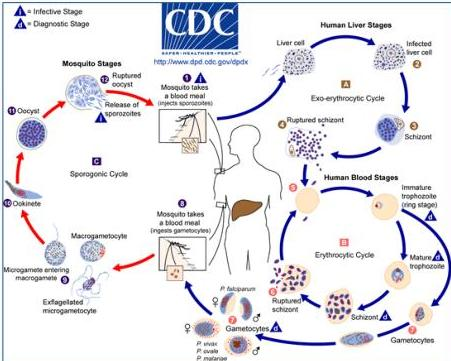

#

# SIKLUS HIDUP MALARIA

Pada malaria berat oleh P. Falciparum dapat terjadi proses sitoaderensi dengan terbentuknya "rosette"

## Stadium hepar manusia (siklus ekso eritrositik)

Nyamuk menghisap darah manusia → injeksi sporozoite → masuk ke dalam sel hati (terinfeksi) → skizon → skizon suptur

## Stadium darah manusia (siklus eritrositik)

Penetrasi merozoite ke dalam RBC → tropozoit fase cincin → tropozit dewasa → skizon → skizon ruptur

Tropozoit fase cincin → gametosit → nyamuk menghidap darah → gametosit masuk ke dalam tubuh nyamuk

## Stadium nyamuk (siklus sporogonik)

Gametosit → zigot terbentuk → ookinete → ookista → ookista pecah melepaskan sporozoit

P. vivax dan P. ovale, sebagian sporozoit membentuk hipnozoit yang dorman dalam hepar.

Kelon Complete Batch Nov 2025

MEDIKO.ID

(PNPK MALARIA, 2019) Hal. 13

4A