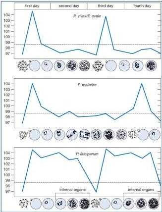

Kelon Complete Batch Nov 2025

MEDIKO.ID
MEDIKO INDOOR ASSOCIATION
(PNPK MALARIA, 2019) Hal.11
4A

# MALARIA VIVAX DAN OVALE (tertiana)
Interval bebas demam 2 hari.
Malaria vivax dapat menjadi berat, ovale biasanya bersifat ringan

# MALARIA MALARIAE (kuartana)
Interval bebas demam 3 hari

# MALARIA FALCIPARUM (tropikana)
Demam timbul intermitten dapat kontinyu, sering menyebabkan malaria berat