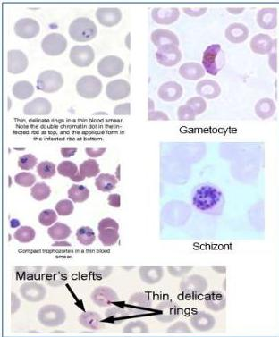

#

# PLASMODIUM FALCIPARUM

|  Masa Inkubasi | 9-14 hari  |
| --- | --- |
|  Eritrosit | Tidak membesar  |
|  Tanda khas | Maurer dot  |
|  Bentuk stadium trofozoit | Cincin (ringform), accole ring, double dot  |
|  Bentuk stadium gametosit | Bulan sabit, pisang, sosis  |

Pada apusan darah tebal : starry-sky pattern

Kelon Complete Batch Nov 2025

MEDIKO.ID

(LANGE INFECTIONOUS DISEASE, 2007) Hal. 289