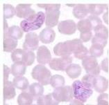
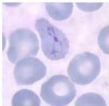
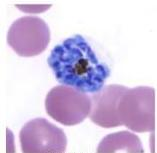
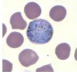

#

# PLASMODIUM VIVAX

|  Masa Inkubasi | 12-17 hari  |
| --- | --- |
|  Eritrosit | Lebih besar, pucat  |
|  Tanda khas | Schuffner dots  |
|  Bentuk stadium trofozoit | Ameboid, ring  |
|  Bentuk stadium gametosit | Sferis  |

Tropozoit

Ring

Schizont

Gametocyte

Kelon Complete Batch Nov 2025

MEDIKO.ID

(LANGE INFECTIOUS DISEASE, 2007) Hal. 289

4A