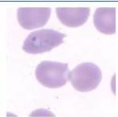
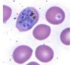
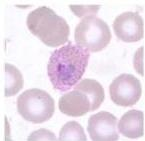
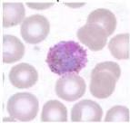

#

# PLASMODIUM OVALE

|  Masa Inkubasi | 12-17 hari  |
| --- | --- |
|  Eritrosit | Lebih besar, oval,
fimbriated  |
|  Tanda khas | James dot  |
|  Bentuk stadium
gametosit | Sferis  |

# MEDIKOLOGIC

Ojek

Ovale: James

Ring

Schizont

Tropozoit

Gametocyte

Kelon Complete Batch Nov 2025

MEDIKO.ID

ASSOCIATION OF MEDICINE

(LANGE INFECTIONOUS DISEASE, 2007) Hal. 289

4A