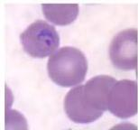
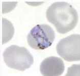
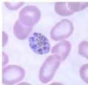
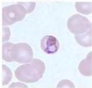

#

# PLASMODIUM MALARIAE

|  Masa Inkubasi | 18-40 hari  |
| --- | --- |
|  Eritrosit | Tidak membesar  |
|  Tanda khas | Ziemann’s dot  |
|  Bentuk stadium trofozoit | Band (pita), rectangular, basket form  |
|  Bentuk stadium gametosit | Sferis  |

Ring

Tropozoit "band"

Schizont

Tropozoit "Basket"

Kelon Complete Batch Nov 2025

MEDIKO.ID

(LANGE INFECTIOUS DISEASE, 2007) Hal. 289

4A