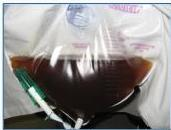

MALARIA BERAT

# KRITERIA (WHO 2015)

Ditemukannya Plasmodium falciparum/vivax stadium aseksual + SALAH SATU manifestasi dari:

1. Perubahan kesadaran (GCS&lt;11, Blantyre &lt;3).
2. Kelemahan otot
3. Kejang berulang &gt;2 episode dalam 24 jam
4. Edema paru (gambaran radiologi atau saturasi O2 &lt;92% dan frekuensi pernafasan &gt;30)
5. Gagal sirkulasi atau syok: pengisian kapiler &gt;3 detik, tekanan sistolik &lt;80 mmHg
6. Jaundice (bilirubin &gt;3 mg/dL dan kepadatan parasit &gt;100.000 pada falciparum)
7. Perdarahan spontan abnormal

# LABORATORIUM

1. Hipoglikemi (GD &lt;40mg/dL)
2. Asidosis metabolic (bikarbonat plasma &lt;15 mmol/L)
3. Anemia berat (Hb &lt;5 endemis tinggi, Hb &lt;7 atau Hct &lt;15%)
4. Hiperparasitemia (parasite &gt;2% eritrosit atau &gt;100.000)
5. Hiperlaktemia (asam laktat &gt;5 mmol/L)
6. Gngguan fungsi ginjal (Scr &gt;3mg/dL atau ureum darah &gt;20 mg/dL)

Kelon Complete Batch Nov 2025

MEDIKO.ID

(PNPK MALARIA, 2019) Hal. 27

3B