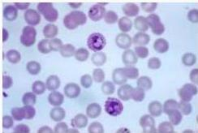

#

# Soal 5

Seorang pria berusia 33 tahun datang ke IGD RSU dengan keluhan demam menggigil dan berkeringat sejak 7 hari yang lalu. Demam dengan jeda waktu bebas demam 2 hari. Pasien sebelumnya diketahui ditugaskan oleh kantornya ke Papua Barat selama 2 bulan. Pada pemeriksaan, kesadaran kompos mentis, TD 110/70 mmHg, HR 95x/menit, RR 18x/menit, suhu, 38,8 C. Pada Pemeriksaan fisik ditemukan adanya hepar teraba 4 jari di bawah arkus kosta. Pada pemeriksaan penunjang didapatkan, Hb 9 g/dL, leukosit 12.000, trombosit 240.000. Pada pemeriksaan apus darah didapatkan hasil sebagai berikut:

## Diagnosis yang tepat adalah...

A. Malaria algid
B. Malaria kuartana
C. Malaria tropikana
D. Malaria tertiana
E. Malaria cerebral

Kelon Complete Batch Nov 2025

MEDIKO.ID

ASSOCIATION OF MEDICINE