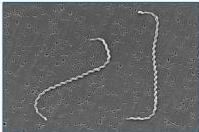
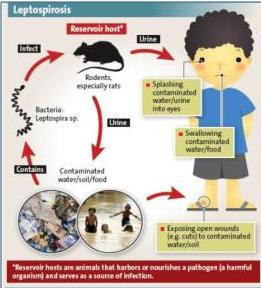

LEPTOSPIROSIS

# DEFINISI

Infeksi yang disebabkan oleh bakteri *Leptospira Interrogans*.
*Leptospirosis berat* → *Weil’s Disease* (melibatkan beberapa gangguan fungsi organ yakni SSP, paru, ginjal, dan hepar)

# FAKTOR RISIKO

- Kondisi hygiene yang buruk
- Banjir → *air tekontaminasi leptospira dari urin tikus*
- Pekerja persawahan atau perkebunan tanpa alas kaki
- Kontak dengan babi, sapi, kambing, anjing, atau terpapar dengan cairannya
- Aktivitas di air tawar
- Pekerja pembersih selokan

*Leptospira Interrogans*
Banyak terdapat pada urin pengerat (tikus)

Kelon Complete Batch Nov 2025

MEDIKO.ID

(PAPDI, 2014) Hal. 633