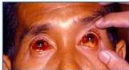
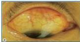

#

# Modified Faine's Criteria

|  Part A: Clinical Data | Score  |
| --- | --- |
|  Headache | 2  |
|  Fever | 2  |
|  If fever, temperature 39°C or more | 2  |
|  Conjunctival suffusion (bilateral) | 4  |
|  Meningism | 4  |
|  Muscle pain (especially calf muscle) | 4  |
|  Conjunctival suffusion+Meningism+Muscle pain | 10  |
|  Jaundice | 1  |
|  Albuminuria or nitrogen retention | 2  |
|  Part B: Epidemiological Factors | Score  |
| --- | --- |
|  Rainfall | 5  |
|  Contact with contaminated environment | 4  |
|  Animal contact | 1  |
|  Part C: Bacteriological and Laboratory Findings  |   |
| --- | --- |
|  Isolation of Leptospira on culture | Diagnosis certain  |
|  Positive serology |   |
|  ELISA IgM positive*: SAT positive*: MAT single high titre* (Any one of the three tests should be scored) | 15  |
|  MAT rising titre (paired sera) | 25  |

A presumptive diagnosis of leptospirosis may be made if: (i) Score of Part A+Part B = 26 or more (Part C laboratory report is usually not available before fifth day of illness; thus it is mainly a clinical and epidemiologic diagnosis during early part of disease) or Part A+Part B+Part C≥25. A score between 20 and 25: Suggests a possible but unconfirmed diagnosis of leptospirosis. doi:10.1371/journal.pntd.0000579.t001

# ANAMNESIS

- Riwayat paparan urin serta air, tanah atau makanan yang terkontaminasi urin dari hewan yang terinfeksi.
- Demam → mendadak + bifasik (demam remiten tinggi pada fase awal leptospiremia (3-10 hari) kemudian demam turun dan muncul saat fase imun).

# TANDA &amp; GEJALA

- Demam
- Conjunctival suffusion
- Bradikardi
- Nyeri tekan otot, terutama betis dan daerah lumbal
- Ronki pada auskultasi paru
- Ikterus
- Meningismus, hipo atau arefleksia terutama pada tungkai

Conjunctival Suffusion

Kelon Complete Batch Nov 2025

MEDIKO.ID

ASSOCIATION FOR DIAGNOSTICS

(SETADI et al, 2014) Hal. 163

4A