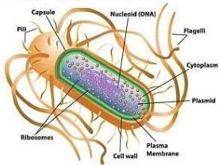
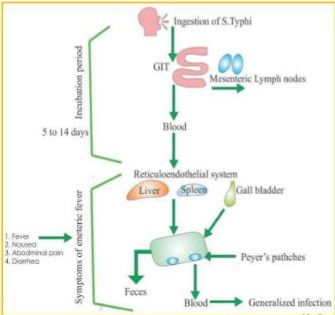

DEMAM TIFOID

# ETIOLOGI

Salmonella typhi atau salmonella paratyphi A, B, C
Bakteri gram (-), berflagel, dan tidak berspora
S typhi -&gt; 3 macam antigen: antigen O, H dan antigen Vi
Ditularkan melalui fekal-oral

Structures of Salmonella Bacteria

Kelon Complete Batch Nov 2025

MEDIKO.ID

(PAPDI, 2014) Hal. 549

4A